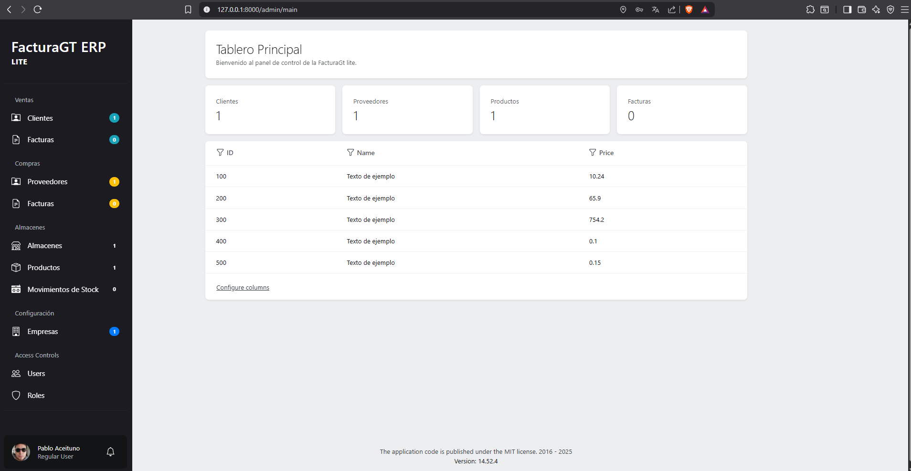
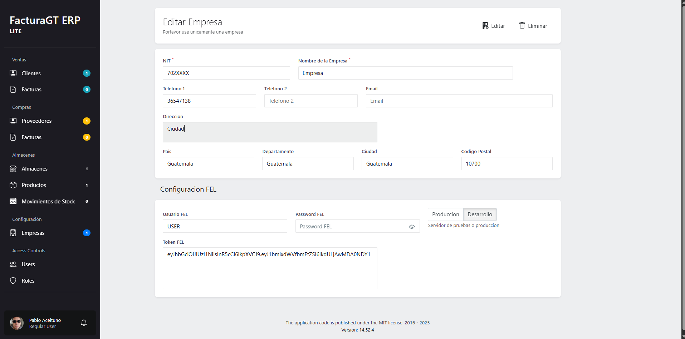

# ERP Lite - Laravel + Orchid

Un sistema **ERP Lite** desarrollado con [Laravel](https://laravel.com) y [Orchid](https://orchid.software/), diseñado para pequeñas y medianas empresas en **Guatemala**, con soporte para **Facturación Electrónica (FEL)** y módulos básicos de gestión.

---

## 🚀 Características principales

- 🛠️ **Framework:** Laravel 12 + Orchid
- 📊 **Dashboard personalizable** con Orchid
- 🧾 **Facturación Electrónica (FEL Guatemala)**
- 🗂️ **Gestión de clientes y proveedores**
- 📦 **Gestión de productos e inventario**
- 💳 **Cuentas por cobrar y pagar**
- 👤 **Multiusuario con roles y permisos**
- 🏢 **Multiempresa (multi-tenant en el futuro)**

---

### Dashboard del sistema

### Configuracion Empresa

